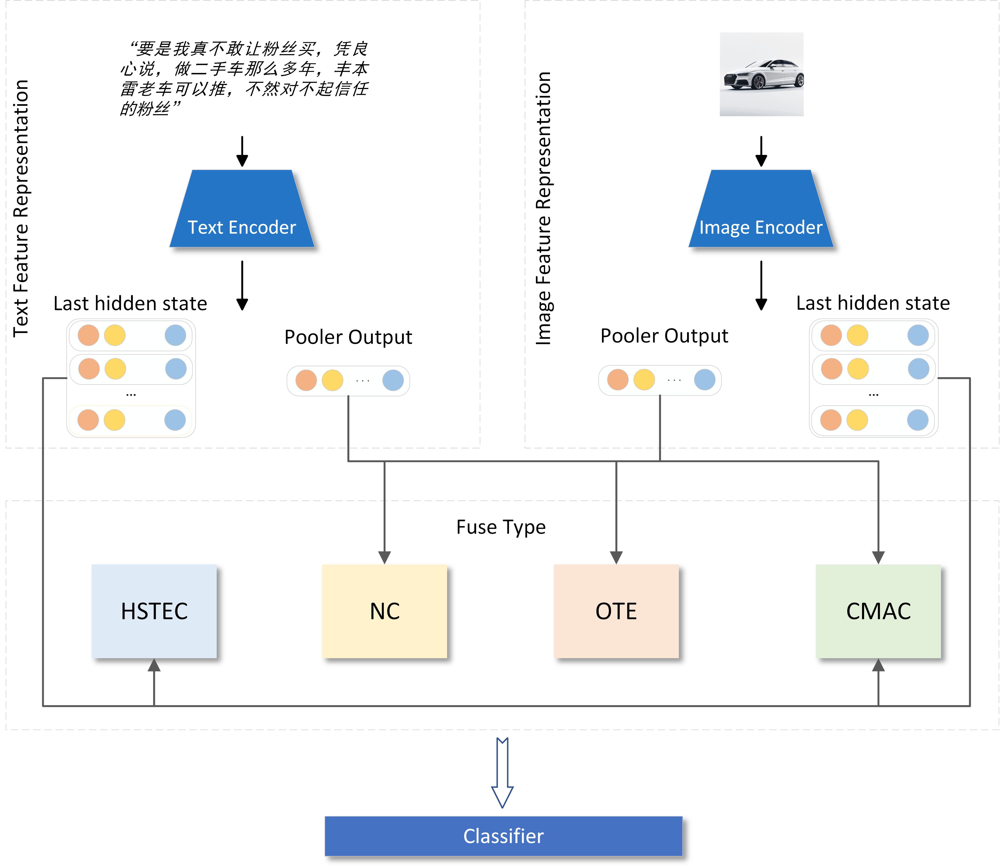

# MM-CLF
A Multimodal Classification Framework.

## Framework：
The framework includes three aspects：  
1. Text feature representation  
2. Image feature representation  
3. Modality fusion  

In this framework, the Text Feature Representation module and Image Feature Representation module allow for the free selection of different feature encoders to obtain suitable combinations of feature encoders. Additionally, it is able to flexibly adjust the modality fusion strategy to effectively capture interactions between different modalities and reduce redundant information during model training.

### Sketch Map 


We provide 5 kinds of fusion types to choose, Naive Concat, Naice Combine, CMAC, OTE, and HSTEC.

### File Structure
```
.
|-- README.md
|-- config.py
|-- data
|   `-- README.md
|-- main.py
|-- model
|-- models
|   |-- __init__.py
|   |-- encoder_image.py
|   |-- encoder_text.py
|   |-- fusion_CMAC.py
|   |-- fusion_HSTEC.py
|   |-- fusion_OTE.py
|   |-- fusion_combine.py
|   |-- fusion_concat.py
|   |-- only_image.py
|   `-- only_text.py
|-- test.ipynb
|-- train.py
`-- utils.py

3 directories, 17 files
```

## Useage

### Requirements
```
datasets==2.13.1
open_clip_torch==2.20.0
Pillow==9.4.0
Pillow==10.0.0
scikit_learn==1.3.0
torch==2.0.0
torchvision==0.15.0
tqdm==4.64.1
transformers==4.33.0
```

Use this command to install all required libraries
```
pip install -r requirements.txt
```


### Download Text/Image Encoders
Download text/image encoders using the following links

Text Models
1. [BERT-wwm-ext](https://huggingface.co/hfl/chinese-bert-wwm-ext)
2. [RoBERTa-wwm-ext](https://huggingface.co/hfl/chinese-roberta-wwm-ext)
3. [Taiyi-roberta](https://huggingface.co/IDEA-CCNL/Taiyi-CLIP-RoBERTa-102M-ViT-L-Chinese)

Image Models
1. [Resnet-50](https://huggingface.co/microsoft/resnet-50)
2. [Vit-base](https://huggingface.co/google/vit-base-patch16-224)

### Prepare data
You can download and use the dataset we provide or build your own dataset following the instructions in the `./data/README.md`

[click here to download our douyin fake comments dataset]()

### Train and Test

##### Primary Arguments
1. `--dataset` (required): Specifies the dataset name to be used, such as `douyin_fake_comments`. It is a string type argument.
2. `--do_train` (boolean flag): If set, the script will train the model on the training set.
3. `--do_test` (boolean flag): If set, the script will evaluate the model on the test set.
4. `--text_encoder`: Specifies the encoder used for text. The default value is `bert`, but it can also be set to `roberta`. It is a string type argument.
5. `--image_encoder`: Specifies the encoder used for images. The default value is `resnet`, but it can also be set to `vit`. It is a string type argument.
6. `--fuse_model_type`: Defines the model for fusing text and image modalities. The default is `concat`, but other options include `combine`, `CMAC`, `HSTEC`, and `OTE`. It is a string type argument.

##### Secondary Arguments
7. `--text_max_seq_len`: Determines the maximum sequence length for text. It is set to 256 by default and is of type integer.
8. `--image_size`: Defines the image size for the image encoder. The default value is 224 and is of type integer.
9. `--image_hidden_size`: Sets the image hidden size for CMAC, HSTEC, and OTE. It has a default value of 64 and is of type integer.
10. `--image_seq_len`: Determines the image sequence length for CMAC, HSTEC, and OTE. It has a default value of 64 and is of type integer.
11. `--lr`: Sets the learning rate. The default value is `5e-5` and is of type float.
12. `--weight_decay`: Defines the weight decay. The default value is `1e-2` and is of type float.
13. `--epoch`: Determines the training epoch. The default value is 1 and is of type integer.
14. `--load_model_path`: Specifies the path to load the trained model. The default value is `None`, indicating no model is loaded by default. It is a string type argument.
15. `--only_text` (boolean flag): If set, the script will only use text to predict.
16. `--only_image` (boolean flag): If set, the script will only use images to predict.
17. `--cuda_device`: Sets the CUDA device to be used. The default value is 0 and is of type integer.
18. `--use_cache` (boolean flag): If set, the script will use cached data or create it if no cached data is found.
19. `--draw_confusion_matrix` (boolean flag): If set, the script will draw the confusion matrix.

#### Usage Example:
```sh
python main.py --dataset douyin_fake_comments --do_train --do_test --text_encoder bert --image_encoder resnet --fuse_model_type concat
```

The above example will run the `main.py` script on the `douyin_fake_comments` dataset, performing both training and testing using `bert` as the text encoder, `resnet` as the image encoder, and `concat` as the fusion model type.
